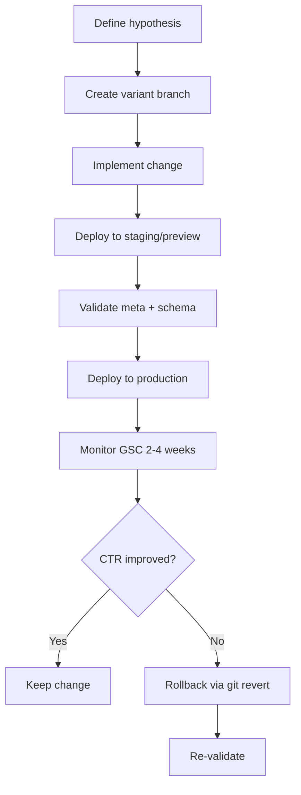

# CTR-Focused SEO Audit: Smartest Garage Doors

## Executive Summary

**Stack:** React 19 + Vite 7 + React Router 7. **Rendering:** Client-side SPA (no SSR/prerender). **Deployment:** Vercel (primary), GitHub Pages (alternate via `gh-pages`). **Canonical base:** `https://www.smartestgaragedoors.com` (from `VITE_SITE_URL` or fallback).

**Findings:**
- **Schema duplication:** Home page has 3 LocalBusiness/Organization sources (HomePage useEffect LocalBusiness + WebSiteSchema + OrganizationSchema + LocalBusinessSchema). Service-area pages may have multiple LocalBusiness instances.
- **og:image:** Only set on index.html (static) and blog post pages. All other pages inherit index.html's og:image or leave it unchanged; DynamicMetaTags only updates og:image when `ogImage` prop is passed.
- **CTA bug:** Bergen County hero has `<button>Get Free Estimate</button>` with no destination (non-functional).
- **Manual meta:** CityServiceAreaPage has a useEffect that sets canonical; DynamicMetaTags also sets canonical. Potential race/overwrite.
- **Internal linking:** ServiceAreaLinks uses `getServiceAreaLinksForService(serviceType)` with service-aware anchor text; anchors vary correctly by serviceType.

---

# 1. PROJECT CONTEXT

## Stack / Framework / Router

| Item | Evidence |
|------|----------|
| Framework | React 19.1.0, react-dom 19.1.0 |
| Build | Vite 7.0.3, @vitejs/plugin-react-swc |
| Router | react-router-dom 7.6.3, `useRoutes` + `BrowserRouter` |
| Rendering | Client-side SPA (no SSR, no prerender) |

**package.json (excerpt):**
```json
"dependencies": {
  "react": "^19.1.0",
  "react-dom": "^19.1.0",
  "react-router-dom": "^7.6.3",
  ...
},
"scripts": {
  "dev": "vite",
  "build": "npm run generate-sitemap && vite build",
  "deploy": "BASE_PATH=/Smart-Garage-Doors-queens-website/ npm run build && gh-pages -d out",
  ...
}
```

**vite.config.ts (excerpt):**
```ts
const base = process.env.BASE_PATH || '/'
export default defineConfig({
  base,
  build: { outDir: 'out', ... },
  ...
})
```

**src/App.tsx:**
```tsx
<BrowserRouter basename={__BASE_PATH__}>
  <AppRoutes />
</BrowserRouter>
```

**src/router/config.tsx:** Defines routes via `RouteObject[]` with `path` and `element`. Uses `useRoutes(routes)` in `AppRoutes`.

## Sitemap / Robots

**public/robots.txt:**
- User-agent: *; Allow rules for /, /book-now/, /contact/, core and service-area paths; Sitemap: https://www.smartestgaragedoors.com/sitemap.xml

**public/sitemap.xml:** 50 URLs, base `https://www.smartestgaragedoors.com/`, lastmod 2026-03-09. Includes core pages, service areas, 9 blog posts.

## Canonical Base URL Logic

- **Source:** `import.meta.env.VITE_SITE_URL || 'https://www.smartestgaragedoors.com'`
- **Used in:** DynamicMetaTags, page-level canonical props, schema URLs
- **.env:** `VITE_SITE_URL="https://smartestgaragedoors.com"` (no www) — **inconsistency:** sitemap/robots use `www.`, .env may not

---

# 2. PAGE INVENTORY & META SNAPSHOT

## Route → File Mapping (from src/router/config.tsx)

| Route Path | Component / File |
|------------|------------------|
| `/` | HomePage → `src/pages/home/page.tsx` |
| `/home/` | HomePage |
| `/contact/` | ContactPage → `src/pages/contact/page.tsx` |
| `/book-now/` | BookNowPage → `src/pages/book-now/page.tsx` |
| `/reviews/` | ReviewsPage → `src/pages/reviews/page.tsx` |
| `/blog/` | BlogPage → `src/pages/blog/page.tsx` |
| `/blog/:slug/` | BlogPostPage → `src/pages/blog/[slug]/page.tsx` |
| `/service-areas/` | ServiceAreasPage → `src/pages/service-areas/page.tsx` |
| `/garage-door-repair/` | GarageDoorRepairPage → `src/pages/garage-door-repair/page.tsx` |
| `/garage-door-installation/` | GarageDoorInstallationPage → `src/pages/garage-door-installation-new-york/page.tsx` |
| `/emergency-garage-door-repair/` | EmergencyRepairsPage → `src/pages/services/emergency-repairs/page.tsx` |
| `/spring-replacement/` | SpringReplacementPage → `src/pages/services/spring-replacement/page.tsx` |
| `/opener-repair-installation/` | OpenerRepairPage → `src/pages/services/opener-repair/page.tsx` |
| `/cable-roller-repair/` | CableRollerRepairPage → `src/pages/services/cable-roller-repair/page.tsx` |
| `/maintenance/` | MaintenancePage → `src/pages/services/maintenance/page.tsx` |
| `/services/installation/` | InstallationPage → `src/pages/services/installation/page.tsx` |
| `/brooklyn-ny/` … (27 service-area paths) | Various → `src/pages/service-areas/*/page.tsx` |

## Meta Snapshot (Evaluated)

*Assumption: `VITE_SITE_URL` = `https://www.smartestgaragedoors.com` for canonical. Location fallback = "Queens NY" when no geo detected.*

| File | URL | title | og:image | DynamicMetaTags | Manual meta |
|------|-----|-------|----------|-----------------|-------------|
| home/page.tsx | / | Garage Door Repair NY NJ CT \| 5.0★ Same-Day \| Smartest Garage Doors | MISSING (not passed) | Y | Y (schema useEffect) |
| contact/page.tsx | /contact/ | Contact Us \| Garage Door Repair NY NJ CT \| Smartest Garage Doors | MISSING | Y | N |
| book-now/page.tsx | /book-now/ | Book Garage Door Service \| Same-Day Repair & Installation \| Smartest Garage Doors | MISSING | Y | N |
| reviews/page.tsx | /reviews/ | Customer Reviews \| 5-Star Garage Door Service NY NJ CT \| Smartest Garage Doors | MISSING | Y | N |
| blog/page.tsx | /blog/ | Garage Door Blog \| Expert Tips & Maintenance Guides \| Smart Garage Doors | MISSING | Y | N |
| blog/[slug]/page.tsx | /blog/{slug}/ | {post.title} \| Smartest Garage Doors Blog | SET (ogImage prop) | Y | N |
| garage-door-repair/page.tsx | /garage-door-repair/ | Garage Door Repair NY NJ CT \| 5.0★ Same-Day \| Smartest Garage Doors | MISSING | Y | N |
| garage-door-installation-new-york/page.tsx | /garage-door-installation/ | Garage Door Installation NY NJ CT \| New Doors & Replacements \| Smartest Garage Doors | MISSING | Y | N |
| services/emergency-repairs/page.tsx | /emergency-garage-door-repair/ | Emergency Garage Door Repair \| 24/7 NY NJ CT \| Smartest Garage Doors | MISSING | Y | N |
| service-areas/bergen-county-nj/page.tsx | /bergen-county-nj/ | Bergen County NJ Garage Door Repair \| Smartest Garage Doors \| 24/7 Emergency Service | MISSING | Y | N |
| service-areas/brooklyn-ny/page.tsx | /brooklyn-ny/ | Brooklyn NY Garage Door Repair \| Smartest Garage Doors \| 24/7 | MISSING | Y | Y (schema useEffect) |

## DynamicMetaTags Fallback Logic (no props / no location)

When `title` is not passed and path matches:
- `/garage-door-repair` → `Garage Door Repair Queens NY | Same-Day Service | Smartest Garage Doors` (or `Garage Door Repair ${locationName} | ...` if location)
- `/garage-door-installation` → `Garage Door Installation Queens NY | Professional Service`
- `/emergency` → `Emergency Garage Door Repair Queens NY | 24/7 Service`
- Else → `24/7 Garage Door Repair Queens NY | Installation | Same-Day`

When `description` is not passed:
- With location → `Professional garage door repair and installation services in ${locationName}. Smartest Garage Doors offers...`
- No location → `Garage door stuck, broken spring, or opener not working? Smartest Garage Doors delivers same-day repair...`

**geoPatterns (title):** `[locationName, location?.city, location?.state, 'NY', 'NJ', 'CT', 'queens', 'brooklyn', 'long island', 'stamford', 'westchester', 'nassau', 'suffolk', 'bergen']`

**geoPatterns (description):** `[locationName, location?.city, location?.state, 'NY', 'NJ', 'CT']`

**canonical:** `siteUrl + routerLocation.pathname` when not passed.

---

# 3. SCHEMA INVENTORY

## Schema Components (Component Render)

| File | @type | Injection |
|------|-------|-----------|
| src/components/seo/LocalBusinessSchema.tsx | LocalBusiness | Component render (script dangerouslySetInnerHTML) |
| src/components/seo/OrganizationSchema.tsx | Organization | Component render |
| src/components/seo/WebSiteSchema.tsx | WebSite | Component render |
| src/components/seo/FAQSchema.tsx | FAQPage | Component render |
| src/components/seo/BlogPostingSchema.tsx | BlogPosting | Component render |
| src/components/seo/Breadcrumbs.tsx | BreadcrumbList | Component render |

## Inline / useEffect Schema

| File | @type | How Injected |
|------|-------|--------------|
| src/pages/home/page.tsx | LocalBusiness | useEffect createElement + appendChild |
| src/pages/garage-door-repair/page.tsx | Service | Inline script |
| src/pages/contact/page.tsx | ContactPage | Inline script |
| src/pages/blog/page.tsx | Blog | Inline script |
| src/pages/blog/[slug]/page.tsx | BlogPosting | BlogPostingSchema component |
| src/pages/service-areas/brooklyn-ny/page.tsx | LocalBusiness | useEffect createElement |

## Duplicate / Conflict Flags

- **Home:** 3+ LocalBusiness/Organization sources. **Duplicate LocalBusiness.**
- **Brooklyn:** useEffect LocalBusiness (Brooklyn address 71st 12th Ave) vs primary (141-24 70th Ave).

## Per-Route Schema Map (Top Routes)

| Route | Schemas Present |
|-------|-----------------|
| / | LocalBusiness (useEffect), WebSite, Organization, LocalBusinessSchema |
| /garage-door-repair/ | Service (provider LocalBusiness), FAQPage, BreadcrumbList |
| /emergency-garage-door-repair/ | FAQPage, BreadcrumbList |
| /contact/ | ContactPage + LocalBusiness (inline), BreadcrumbList |
| /brooklyn-ny/ | LocalBusiness (useEffect), FAQPage, BreadcrumbList |

---

# 4. DYNAMICMETATAGS LOGIC

## Branching Summary

- **Title:** No prop → route-based default (repair/installation/emergency/generic). With prop + location + no geo in title → append ` - Serving ${locationName}`.
- **Description:** No prop → location or generic. With prop + location + no geo → append ` Serving ${locationName} and surrounding areas.`
- **Keywords:** Default + optional `location.city garage door repair, garage door service ${locationName}`.
- **Canonical:** Prop or `siteUrl + pathname`.
- **OG/Twitter:** ogTitle/ogDescription from props or final title/description; og:url = canonical.
- **og:image:** Updated only when `ogImage` is passed; otherwise leaves existing tag (from index.html) unchanged.
- **noindex:** Sets robots when `noIndex` true.

## Race Conditions / Head Conflicts

- **CityServiceAreaPage:** useEffect sets canonical; DynamicMetaTags also sets canonical. Both run; last writer wins. Values should match (same canonicalUrl passed).

---

# 5. SERVICE-AREA PAGES

| File | URL | Manual meta? | Hero CTA |
|------|-----|--------------|----------|
| bergen-county-nj/page.tsx | /bergen-county-nj/ | N | `<a href="tel:...">`; **`<button>Get Free Estimate</button>` (NO HREF)** |
| brooklyn-ny/page.tsx | /brooklyn-ny/ | Y (schema useEffect) | `<a href="tel:...">`; `<a href="/book-now/">Get Free Estimate</a>` |

**Bergen County CTA (broken):**
```tsx
<button className="bg-white text-blue-900 ...">Get Free Estimate</button>
```
**Fix:** Use `<a href="/book-now/" ...>Get Free Estimate</a>` (like Brooklyn).

---

# 6. TOP MONEY PAGES

| Route | File | Hero H1 | Primary CTA | Phone |
|-------|------|---------|-------------|-------|
| / | home/page.tsx | (Hero component) | Call + Book Now | tel:+19145576816 |
| /garage-door-repair/ | garage-door-repair/page.tsx | Professional Garage Door Repair Services | Call + Get Free Quote | tel:+19145576816 |
| /emergency-garage-door-repair/ | services/emergency-repairs/page.tsx | 24/7 Emergency Garage Door Repair | Call Emergency Line + Schedule Emergency Service | tel:+19145576816 |
| /garage-door-installation/ | garage-door-installation-new-york/page.tsx | Garage Door Installation New York | Call + Get Free Quote | tel:+19145576816 |
| /services/installation/ | services/installation/page.tsx | (section) | Phone + Book Now | tel:+19145576816 |
| /book-now/ | book-now/page.tsx | Book Your Service Now | Emergency: (914) 557-6816 | tel:+19145576816 |
| /contact/ | contact/page.tsx | Contact & Schedule Service | Call Now + Schedule Online | tel:+19145576816 |
| /reviews/ | reviews/page.tsx | Customer Reviews | Call: (914) 557-6816 | tel:+19145576816 |
| /service-areas/ | service-areas/page.tsx | Service Areas | — | — |
| /blog/garage-door-repair-cost-guide-2025/ | blog/[slug]/page.tsx | {post.title} | Call + Schedule Service | tel:+19145576816 |

Conversion forms (contact, book-now, emergency, installation, etc.) use `submitForm`; unaffected by meta/schema changes.

---

# 7. INTERNAL LINKING & ANCHOR TEXT

## getServiceAreaLinksForService (src/utils/internalLinking.ts)

- **baseAreas:** 10 areas (Queens, Brooklyn, Long Island, Staten Island, White Plains, Stamford, Greenwich, Westchester County, Nassau County, Suffolk County).
- **serviceDescriptions:** repair, emergency, spring, installation, opener, cable, maintenance — each has custom descriptions per slug (e.g. "Garage door repair in Queens").
- **Return:** baseAreas with description overridden when `serviceDescriptions[serviceType][slug]` exists.

## ServiceAreaLinks.tsx

- Uses `getServiceAreaLinksForService(serviceType).slice(0, maxLinks)` (default maxLinks=8).
- Renders `<Link to={area.url}>` with `area.text` (e.g. "Queens, NY") and `area.description` (e.g. "Garage door repair in Queens").

## Anchor Text by serviceType

| serviceType | Example (Queens) |
|-------------|------------------|
| repair | Garage door repair in Queens |
| installation | Garage door installation in Queens |
| emergency | Emergency garage door repair in Queens |
| spring | Spring replacement in Queens |
| opener | Opener repair in Queens |
| cable | Cable and roller repair in Queens |
| maintenance | Garage door maintenance in Queens |

**Anchors vary by serviceType:** Yes. maxLinks=8 by default.

---

# 8. OG IMAGES & SOCIAL

## Pages That Set og:image

| Page URL | og:image URL | Where Set |
|----------|--------------|-----------|
| / (initial load) | https://static.readdy.ai/image/.../4d43fd0bc8f747590e796db153cdd63c.png | index.html |
| /blog/{slug}/ | Post image (getBlogImage / BLOG_POSTS) | DynamicMetaTags ogImage prop |

## Pages Missing og:image

Contact, book-now, reviews, blog index, garage-door-repair, garage-door-installation, emergency, spring, opener, cable, maintenance, services/installation, service-areas, all service-area pages.

**Candidate hero images:** smartestgaragedoors.com/wp-content (e.g. Ben-fixing-door-scaled.jpg, appointment.png), readdy.ai search-image (external), local `/hero-van-1280.webp`.

**Favicon:** index.html: `/favicon.png` (32x32), `/apple-touch-icon.png` (180x180). Expected in `public/`.

---

# 9. FOR SAFE CHANGES: RISK MAP

| Change | Files | Risks | Reversibility |
|--------|-------|-------|---------------|
| Title rewrite | Page components | Intent mismatch | `git checkout -- <file>` |
| Meta description rewrite | Page components | CTR impact | Same |
| CTA button→link (Bergen) | bergen-county-nj/page.tsx | Low | Same |
| Schema dedupe (Home) | home/page.tsx | Geo in schema | `git revert` |
| DynamicMetaTags logic | DynamicMetaTags.tsx | All pages | Single file revert |
| Add ogImage | Page components | Low | Per-file revert |

**Revert commands:**
```bash
git checkout -- <file>
git revert <commit-hash>
```

---

# 10. QA & DEPLOY CHECKLIST

## Browser Checks (Per Top Money Page)

For: /, /garage-door-repair/, /emergency-garage-door-repair/, /garage-door-installation/, /services/installation/, /spring-replacement/, /opener-repair-installation/, /cable-roller-repair/, /maintenance/, /book-now/, /contact/, /reviews/, /service-areas/, /blog/garage-door-repair-cost-guide-2025/

1. **Single title:** One `<title>`, correct text.
2. **Single meta description:** One `meta[name="description"]`, correct content.
3. **Single canonical:** One `link[rel="canonical"]`, correct href.
4. **CTA destinations:** Book Now / Get Free Estimate / Schedule → /book-now/.
5. **tel: links:** Phone CTAs use `tel:+19145576816`.

## Structured Data Validation

- **Rich Results Test:** Test /, /garage-door-repair/, /contact/, /brooklyn-ny/, /blog/garage-door-repair-cost-guide-2025/
- **Schema validator:** Paste JSON-LD from page source; check duplicates and NAP.

## GSC Validation

**Pages to monitor:** /, /garage-door-repair/, /emergency-garage-door-repair/, /garage-door-installation/, /book-now/, /contact/, /reviews/, /bergen-county-nj/, /brooklyn-ny/, /queens-ny/

**Sample queries:** garage door repair queens, emergency garage door repair bergen county, garage door installation stamford ct, garage door repair brooklyn, smartest garage doors

## A/B Testing Workflow (Mermaid)



---

*End of audit. No code changes were applied.*
